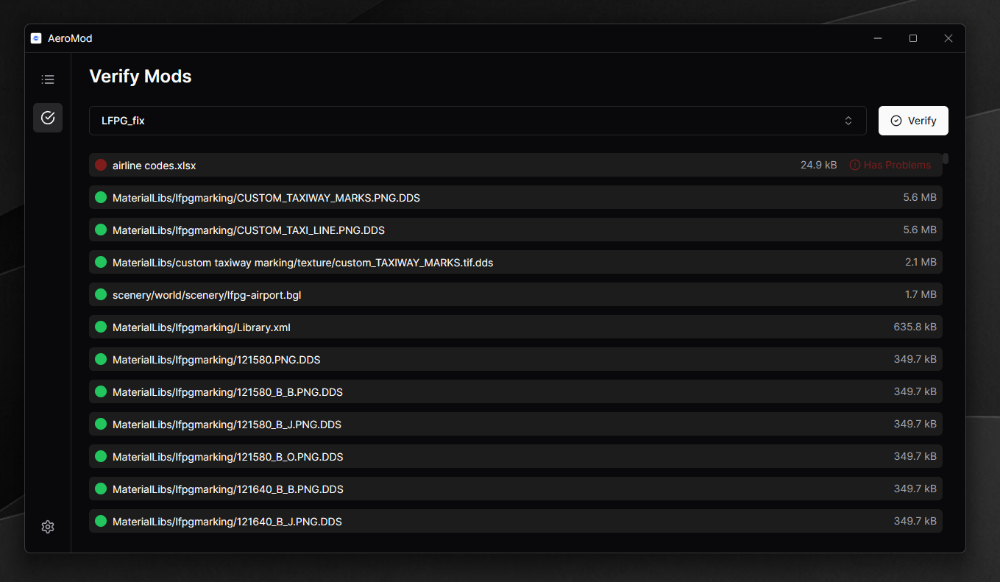
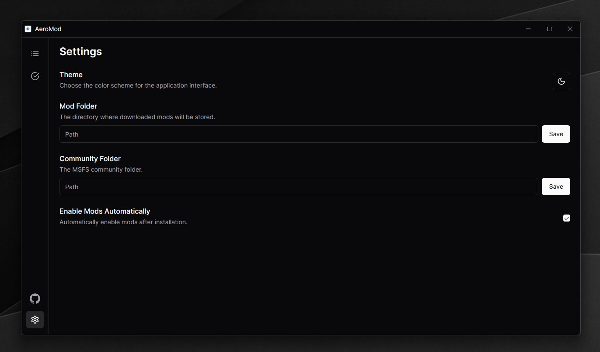

<h1 align='center'>AeroMod</h1>

<p align="center">
   <br/>
</p>

<p align="center">
An external mod manager for Microsoft Flight Simulator.
</p>

<p align="center">
  <a href="https://wails.io/">
    
  </a>
  <a href="https://react.dev/">
    
  </a>
</p>

<div align="center">
<strong>
<samp>

[English](README.md)

</samp>
</strong>
</div>

## About

AeroMod is a tool designed to efficiently manage Microsoft Flight Simulator mods. With AeroMod, you can easily enable, disable, install, and uninstall mods without physically moving files. AeroMod is Windows-only.

## Screenshots


### Verify Mods



### Settings



## Features

- Enable/Disable mods.
- Install/Uninstall mods.
- Verify mod files.
- Search for mods.
- Display mod details such as type, author, and version.

## Roadmap

- Add presets for saving enabled mods.
- Display scenery locations on a map.
- Mod grouping ability.
- Checking version conflicts.
- Installing mods from remote URLs.
- Categories for searching mods efficiently (e.g., SCENERY, LIVERY).

## Environment Setup

- [Go](https://go.dev/doc/install)
- [Node](https://nodejs.org/en/learn/getting-started/how-to-install-nodejs)
- [Wails](https://wails.io/docs/next/gettingstarted/installation)

> As AeroMod is primarily developed using the Wails framework, the environment can be set up following the [installation tutorial of Wails](https://wails.io/docs/gettingstarted/installation).

### Installation

```bash
git clone https://github.com/fly2z/aeromod.git
cd aeromod
wails dev
```
